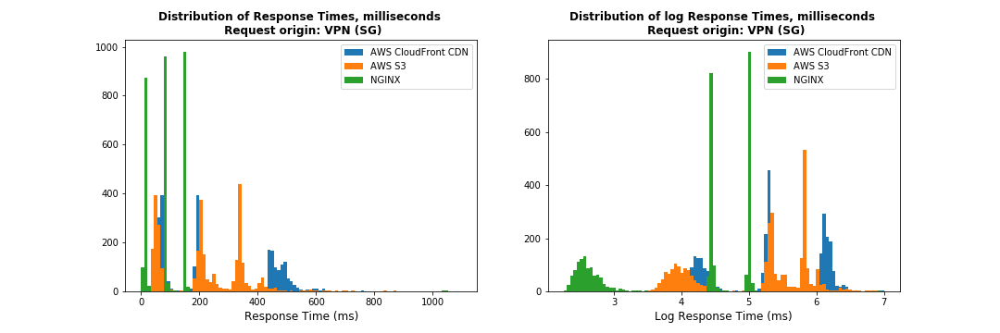
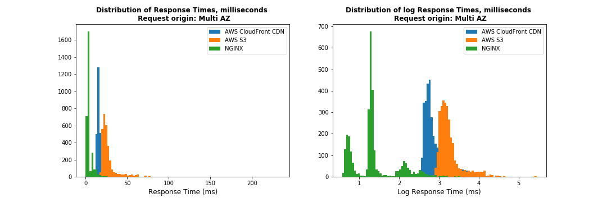
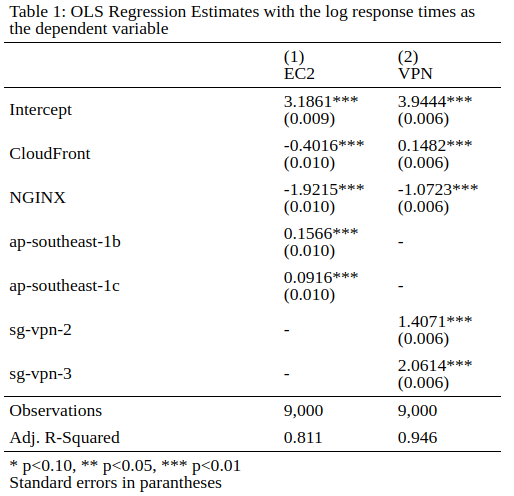

## A Statistical Comparison of Content Delivery Speeds - CloudFront CDN vs S3 vs Nginx

A statistical comparison of transfer speeds for files served from a Content Delivery Network (AWS CloudFront), a cloud storage service (AWS S3), and a static file server (Nginx) hosted in the Singapore region. An experiment was conducted to compare the response times of a HTTP GET request of a 256KB file served from the three different content delivery methods, with the requests orginating from the Singapore region.

Content Delivery Networks serve as web proxies and allows caching of data nearer to the requesting user's location. Using a CDN can greatly increase transfer speeds if you are serving content to a global audience.

However, if you are serving content solely to a local region, static files served with a CDN may not be faster than files served using a regular storage service (i.e., AWS S3). This may be even more so in a small region like Singapore, where distances between data centers are relatively short.

## Motivation

CDNs are widely used to provide fast delivery of web content by using geographically distributed servers that cache data nearer to the requester's location. Using a CDN can greatly reduce the response time of a HTTP request, especially if the application is serving content to a global audience.

However, it is not immediately obvious if a CDN will deliver content faster for applications that serve only a local region. For the case of Singapore, where distances between data centers are relatively small, a CDN may not have a speed advantage over simpler cloud storage solutions when the request originates within the Singapore region itself.

Therefore, answering this question can better inform decision makers on the relative benefits and costs pertaining to the use of CDNs and other content delivery solutions, especially in the unqiue case of delivering local content from within the Singapore region.

## Experimental Setup

A 256kb payload file is created and hosted on a CDN, a storage service, and a manually deployed file server. The experiment will revolve around recording the response times from making HTTP GET requests for the payload file served from each of the three content delivery methods. Code and instructions for the setup can be found [here](./0&#32;-&#32;Setup.ipynb).

1. **AWS Simple Storage Service (S3)**   - Amazon's default cloud storage service. File hosted on *ap-southeast* region which is located in Singapore.
2. **AWS CloudFront**   - Amazon's Content Delivery Network Service
3. **NGINX Web Server**   - A popular open source web server. File server deployed in Singapore using AWS EC2 instance in the *ap-southeast-1a* availability zone.

### Experimental Runs
The experiment consists of three runs, with each run varying in the request origin. 
1. [From Local Machine in Singapore](./1&#32;-&#32;Experiment&#32;on&#32;Local&#32;Machine.ipynb)
2. [From EC2 instances in three availability zones in Singapore region](./2&#32;-&#32;Experiment&#32;in&#32;3&#32;Availability&#32;Zones.ipynb)
3. [Using a VPN proxy through three different servers in Singapore](./3&#32;-&#32;Experiment&#32;using&#32;VPN.ipynb)

## Summary of Results

### Regression Models

#### (1) EC2 - Experimental run on EC2 instances in three availability zones in ap-southeast-1 region ####

$$ log(T_i) = \beta_0 + \beta_1\text{Nginx}_i + \beta_2\text{Cloudfront}_i + \beta_3\text{ap-southeast-1b}_i + \beta_4\text{ap-southeast-1c}_i + \epsilon_i $$ 

#### (2) VPN - Experimental run with requests proxied through three Singapore servers with a VPN ####

$$ log(T_i) = \beta_0 + \beta_1\text{Nginx}_i + \beta_2\text{Cloudfront}_i + \beta_3\text{vpn-2}_i + \beta_4\text{vpn-3}_i + \epsilon_i $$

## Conclusion

It is common practice to deploy a CDN to speed up the delivery of static content, and in most cases, the CDN does the job well by caching the content on geographically distributed servers. However, for an application solely serving a local region such as Singapore, the benefits of using a CDN are diminished.

This analysis has shown statistically that serving static content in the Singapore region through a CDN (CloudFront) can in fact be slower than through a basic cloud storage service (AWS S3). In addition, our analysis also suggests that a Nginx static file server outperforms both the CDN and the cloud storage service in this area. 

However, a few caveats are in order. The response times are recorded via network requests through a local machine, vpn, and ec2 instances. These timings may not be representative of the typical user experience as the variation in origin locations of the experimental requests are quite limited. 

These comparisons are also conducted solely on AWS infrastructure. Using other service providers may yield different results. 

Lastly, the performance of the Nginx server is likely biased downwards (faster) as the requests to the file server are HTTP based, as compared to HTTPS on S3 and CloudFront. Enabling HTTPS on the Nginx file server would be a fairer comparison against the other methods as the time taken for the SSL/TLS handshake is not insignificant at the millisecond scale. 

There are many other factors to consider when choosing between the different content delivery methods, with speed being only one consideration. Cloud storage and CDN provide other benefits such as being highly available and redundant. Decoupling the serving of static files from your main application is also a good practice. Nevertheless, the results of this study do suggest that if speed is the main consideration, then perhaps a CDN may not be all that effective when serving a small local region such as Singapore.
